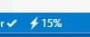

# VSCode TODO Parser Extension
[](https://marketplace.visualstudio.com/items?itemName=minhthai.vscode-todo-parser)
[](https://marketplace.visualstudio.com/items?itemName=minhthai.vscode-todo-parser)
[](https://marketplace.visualstudio.com/items?itemName=minhthai.vscode-todo-parser)

[](https://github.com/kantlove/vscode-todo-parser/issues)
[](https://travis-ci.org/kantlove/vscode-todo-parser)
[](https://github.com/kantlove/vscode-todo-parser)

Parse TODOs in your working files.


## Install

- Visit the Market [here](https://marketplace.visualstudio.com/items?itemName=minhthai.vscode-todo-parser).
- Or open VSCode, press **F1** then type this command `ext install vscode-todo-parser`. Press **Enter** to install.

## Features

Parse TODOs in the current document:
- Open a file.
- The __TODO Counter__ on Status Bar shows the number of TODO in the current document.

  

- Click on the __Counter__ to parse TODOs in the current document..
- Alternatively, in the **F1** command menu, select **Parse TODOs (current document)**.

Parse TODOs in the project:
- Press __F1__ > __Parse TODOs (all files)__.

_Note that for large projects, the result will be displayed gradually. You can see the progress at the bottom (the bolt icon :zap:). **Clicking on it will cancel the task**._



We support both single-line and multi-line comments. For example:

```java
// TODO: this todo is valid

/* TODO: this is also ok */

/* It's a nice day today
 *
 * Todo: multi-line TODOs are
 * supported too!
 */
```

## Settings

Include the below snippet in your __User Settings__ (File > Preferences > User Settings).
```json
"TodoParser": {
  "exclude": ["cpp", "c"],
  "include": ["js"],
  "folderExclude": ["node_modules", ".vscode"],
  "only": ["sub-folder/sub-sub-folder"],
  "markers": ["NOTE:", "REMINDER:"],
  "autoDefaultMarkers": true
}
```
#### exclude
Set which __file extension__ you want to exclude. For example, `"exclude": ["cpp"]` will exclude all __*.cpp__ files from __Parse TODOs (all files)__.
#### include
Set which __file extension__ you want to include. If both **include** and **exclude** entry exist, **include** is prefered (ignore value of **exclude**).
#### folderExclude
Set which __folder__ you want to exclude. Allowed values are __folder names only__ (not directory path).
#### only
Set which __folder__ you want to focus on. 

If both *only* and *folderExclude* exist, *only* is prefered. In that case, *folderExclude* entry will work inside these *only* folders.

Each item is a path under the root folder. For example:
- Your project structure is:
```
root
|-src
|  |--common
|  +--models
|     |--item.ts
|     +--test
+-static
```
- And you only want to focus on the *root/src/models* folder. But you'd like to ignore the *root/src/models/test* folder. Then your setting should be:
```json
"TodoParser": {
  "folderExclude": ["test"],
  "only": ["src/models"]
}
```

#### markers
Contains the words that signal the start of TODOs. For example, `"markers": ["NOTE:"]` will enable matching `NOTE: this is a new type of TODO`.


#### autoDefaultMarkers
If `true`, automatically add the default "TODO" marker. Default is `true`.


## Supported languages
Java, Javascript, C#, C, C++, F#, Python, Ruby, Coffee Script, R, Haskell, Lua, Go, Perl,
Markdown, Css, Scss, Less, Latex, Typescript, Elixir, Shell Script, Twig, Visual Basic.

*Note that multi-line comment style is only supported in languages that have the syntax in the example.*

## Contribution
This is a small project by a passionate student so any contribution is welcome and loved :+1:


